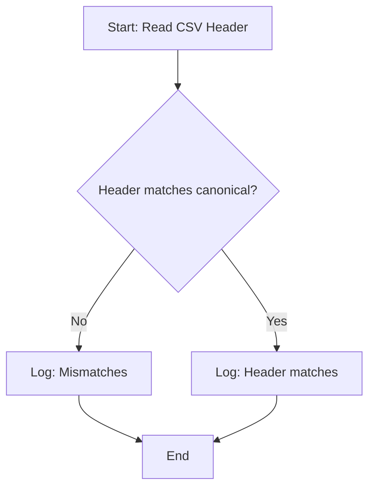
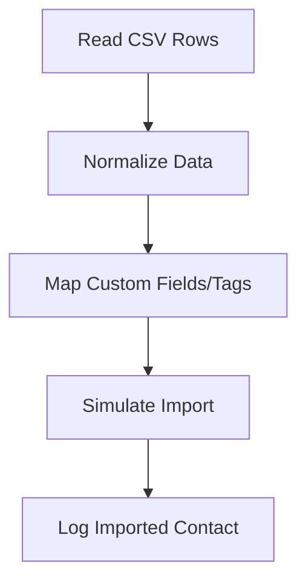
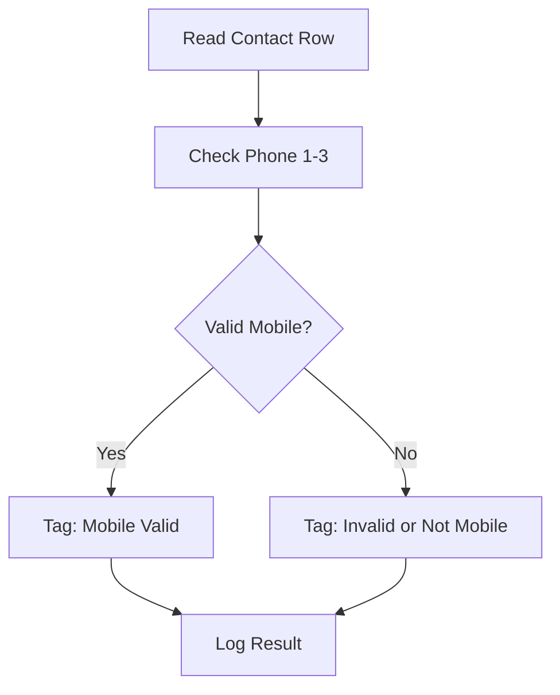
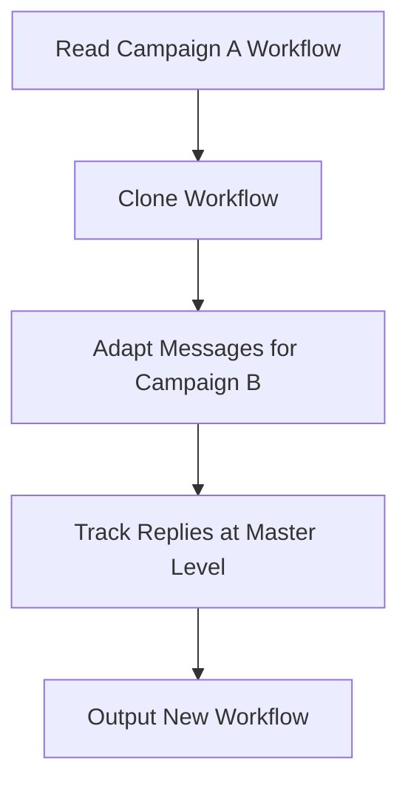
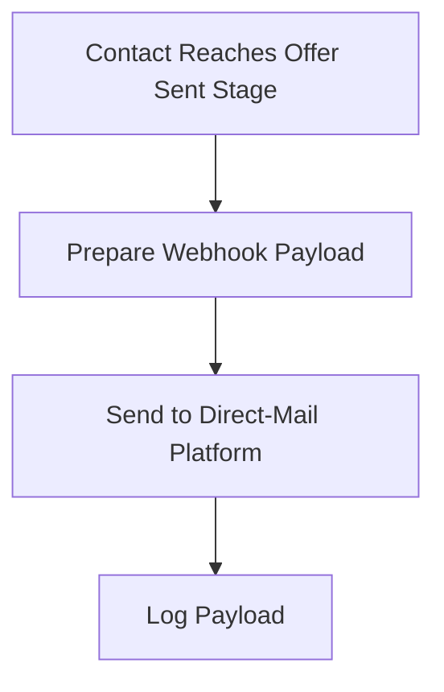
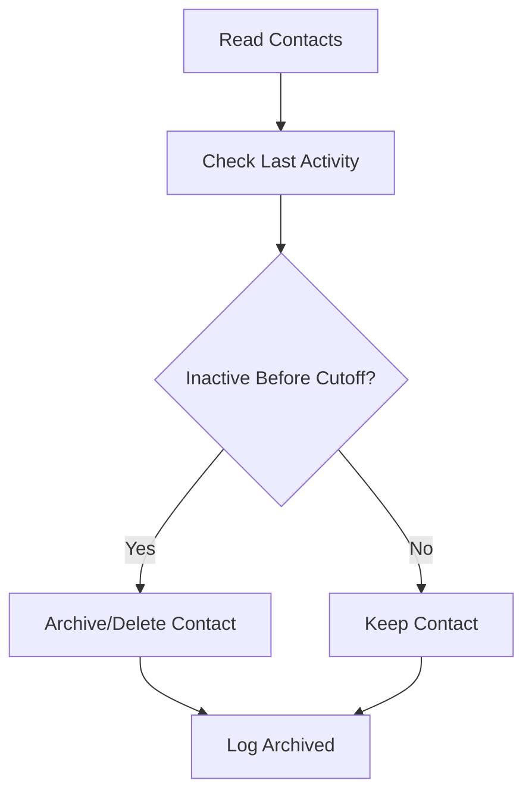

# Workflows and Diagrams

This document provides workflow and data flow diagrams for the Go High Level Automation Demo project.

---

## 1. CSV Header Validation



---

## 2. Bulk Contact Import & Normalization



---

## 3. Phone Validation Workflow



---

## 4. AI-SMS Workflow Cloning & Adaptation



---

## 5. Zapier Webhook Simulation



---

## 6. Quarterly Data Purge



---

## Data Flow Overview

```mermaid
graph LR
    A[CSV File] --> B[Validation]
    B --> C[Import & Normalization]
    C --> D[Phone Validation]
    D --> E[Workflows (SMS, Zapier, Purge)]
    E --> F[Logs/Reports]
``` 